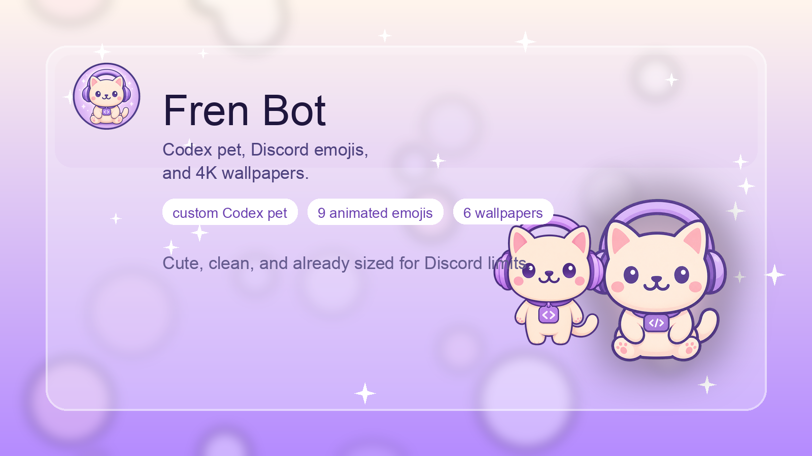
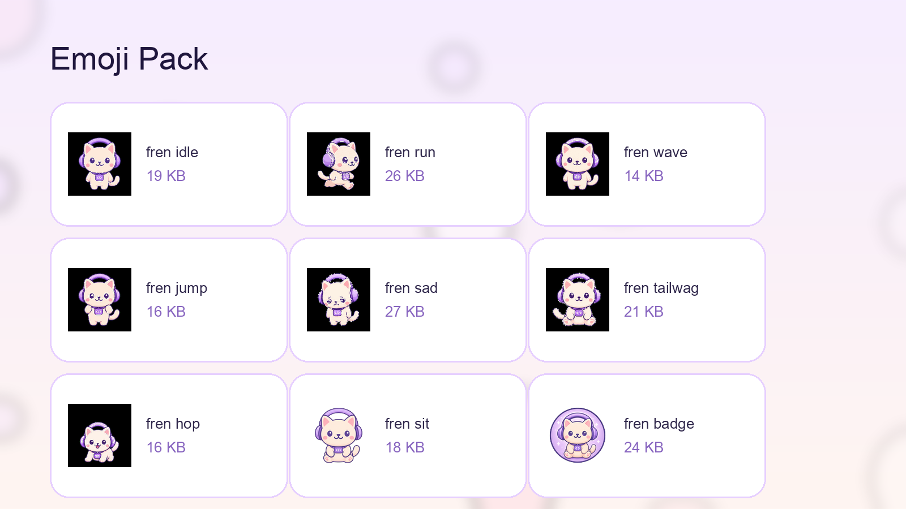
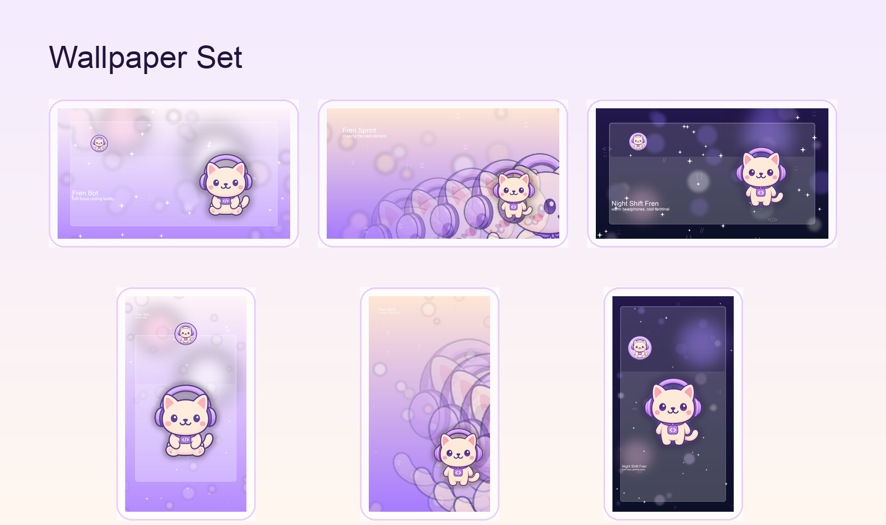

# Fren Bot



Cute Fren-inspired Codex pet package with a Discord emoji pack and matching 4K wallpapers.

## What's Here

- `codex-pet/fren-bot/` contains the installable Codex pet package.
- `emojis/` contains Discord-ready animated and static emoji exports.
- `wallpapers/` contains 4K desktop and phone wallpapers.
- `assets/` contains the tracked pet art, badge art, custom emoji source strips, and README graphics.

## Install In Codex

```bash
mkdir -p ~/.codex/pets
cp -R codex-pet/fren-bot ~/.codex/pets/fren-bot
```

Then pick `custom:fren-bot` inside Codex.

## Emoji Pack



Animated emojis:

- `fren_idle`
- `fren_run`
- `fren_wave`
- `fren_jump`
- `fren_wait`
- `fren_review`
- `fren_sad`
- `fren_tailwag`
- `fren_hop`

Static emojis:

- `fren_sit`
- `fren_stand`
- `fren_badge`

Everything in `emojis/` is already exported small enough for Discord upload.

## Wallpapers



Included sets:

- `wallpapers/desktop/fren-dream-desktop-4k.png`
- `wallpapers/desktop/fren-sprint-desktop-4k.png`
- `wallpapers/desktop/fren-night-desktop-4k.png`
- `wallpapers/phone/fren-dream-phone-4k.png`
- `wallpapers/phone/fren-sprint-phone-4k.png`
- `wallpapers/phone/fren-night-phone-4k.png`

## Rebuild

```bash
python3 scripts/build_assets.py
```

This regenerates the emoji pack, wallpaper set, and README graphics from the tracked pet assets and custom emoji source strips.

## Cache

Heavy generation leftovers live under `.cache/` and are gitignored.
