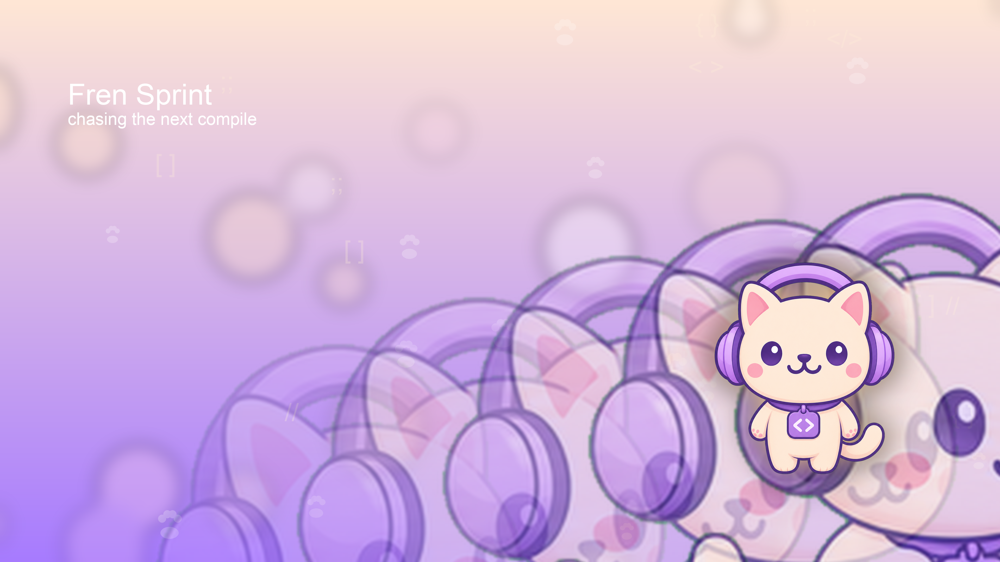
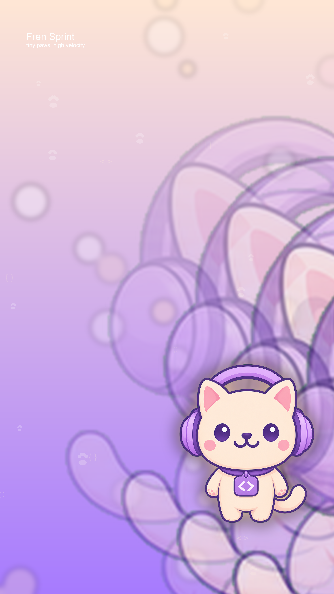

# Fren Bot


Cute Fren-inspired Codex pet with transparent Discord emojis, a WhatsApp-ready animated sticker pack, and 4K wallpapers for desktop and phone.

## Codex Pet

The installable pet lives in `codex-pet/fren-bot/`.

```bash
mkdir -p ~/.codex/pets
cp -R codex-pet/fren-bot ~/.codex/pets/fren-bot
```

Then select `custom:fren-bot` in Codex.

## Discord Emojis

Transparent animated emojis:

- `fren_idle`
- `fren_run`
- `fren_wave`
- `fren_jump`
- `fren_wait`
- `fren_review`
- `fren_sad`
- `fren_tailwag`
- `fren_hop`

Static emojis:

- `fren_sit`
- `fren_stand`
- `fren_badge`

<p>
  
  
  
  
  
  
</p>
<p>
  
  
  
  
  
  
</p>

Everything in `emojis/` is already sized for Discord upload.

## WhatsApp Stickers

Animated sticker pack files are in `whatsapp-pack/android-assets/`.

- `contents.json` holds the pack manifest.
- `1/*.webp` contains the animated transparent sticker files.
- `1/tray_fren_bot.png` is the tray icon.

## Wallpapers

Desktop:

- `wallpapers/desktop/fren-clouds-desktop-4k.png`
- `wallpapers/desktop/fren-midnight-desk-desktop-4k.png`
- `wallpapers/desktop/fren-sprint-desktop-4k.png`

Phone:

- `wallpapers/phone/fren-clouds-phone-4k.png`
- `wallpapers/phone/fren-midnight-phone-4k.png`
- `wallpapers/phone/fren-sprint-phone-4k.png`




<p>
  
  
  
</p>
